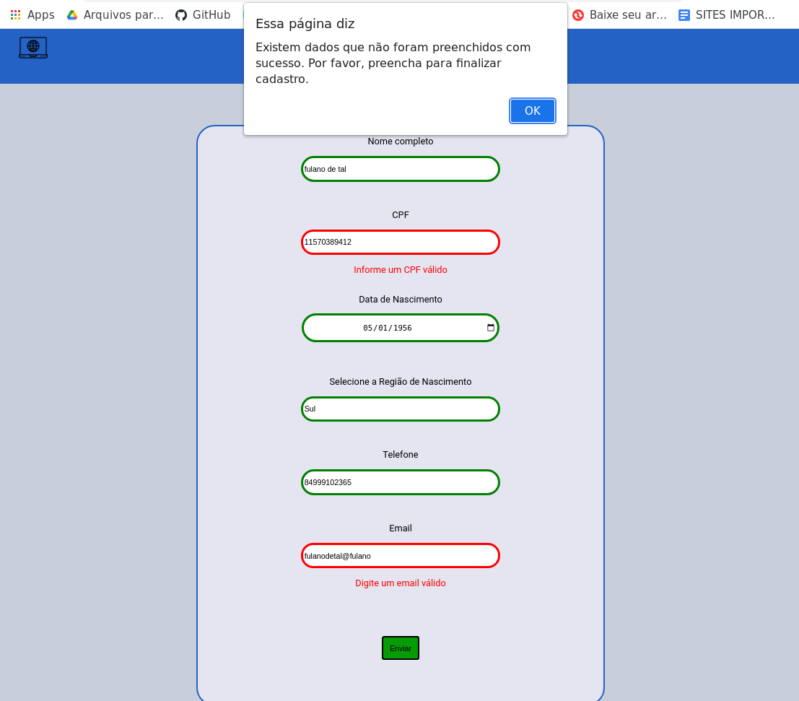

## Formulário

### Projeto com cores claras.
- Este simples formulário visa fazer o usuário preencher os campos com seus dados pessoais, e a cada preenchimento é feita a verificação para saber se o dado inserido pelo cliente é válido ou não, caso seja válido ficará verde a borda da opção que digitou, caso contrário fica vermelho.
- Após inserir todos os dados e clicar no botão para enviar, uma janela de pop-up aparece informando se todos os dados foram enviados ou se faltou preencher algum dado.

### Modelo:

