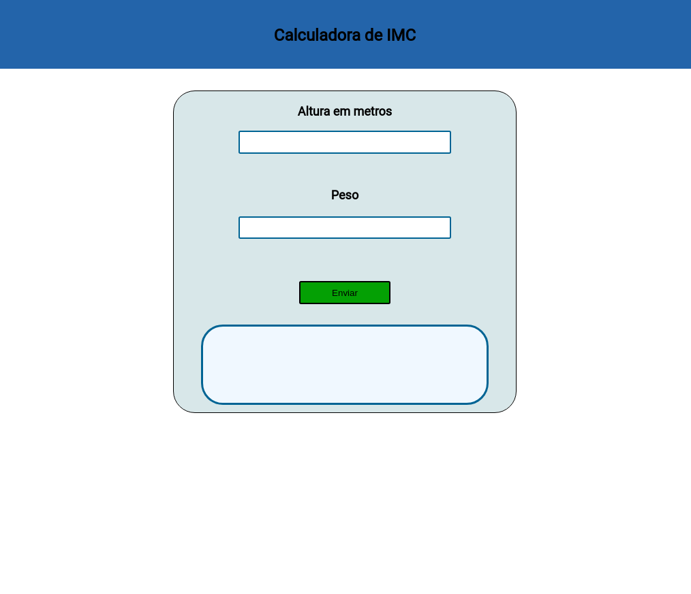

# Calculadora de IMC

## O que é
O projeto trata de uma calculadora de IMC. O ponto principal deste projeto é a prática com o JavaScript e não o design.

## Tecnologias utilizadas
- HTML5 
- CSS3
- JavaScript

## Execução
- Execute o arquivo index.html e depois preencha os campos altura e peso, depois envie os dados e será retornado o resultado.

## Modelo 

- Imagem que aparece assim que executado o arquivo index.html.
- Para ter acesso aos resultados, clone o repositório.

