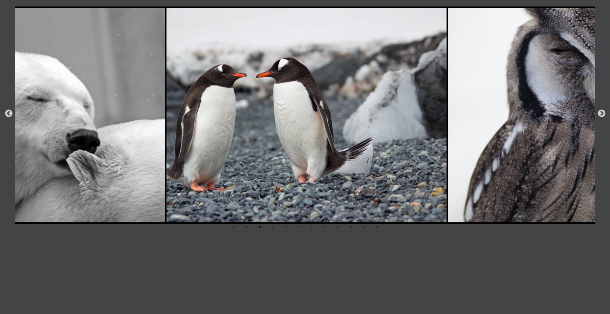

# Slides com Slick

## O que é
O projeto trata de um carrossel/slides de imagens utilizando a biblioteca Slick do JavaScript.

## Tecnologias utilizadas
- HTML5 
- CSS3
- JavaScript
- Slick

## Execução
- Execute o arquivo index.html e visualize o carrosel, é possível a interação do usuário para com o projeto, basta apertar os botões.

## Modelo

- Imagem que aparece assim que executado o arquivo index.html.
- Para ter acesso aos resultados, clone o repositório.

