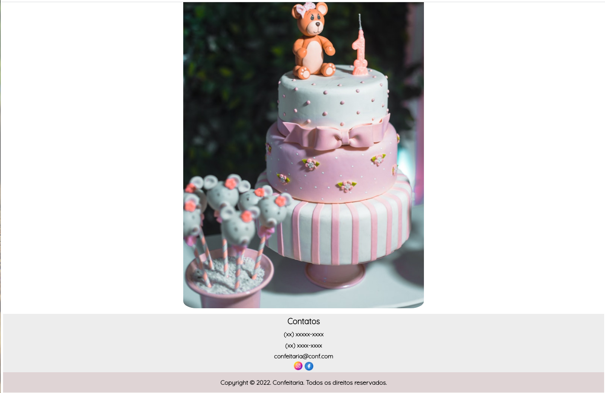

### Modelo de página Home

- Modelo de página home para uma confeitaria.
- O modelo foi escrito em HTML5 e CSS3, utilzando um modelagem mais minimalista e com cores que combinam com as imagens utilizadas.
-  Algumas imagens do site estarão aqui no README, porém para uma melhor experiência e completa, clone o repositório e execute no Browser de Internet.
-  Imagens retiradas do site pexels.

#### Algumas imagens do site: 

