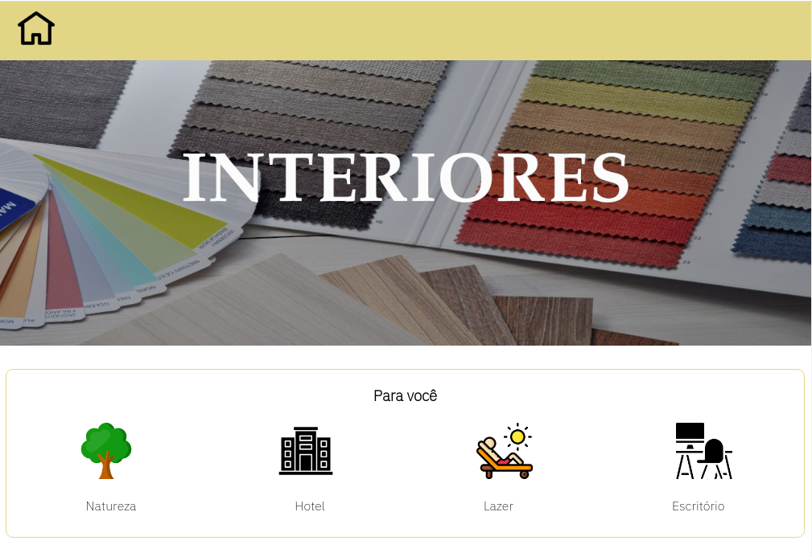
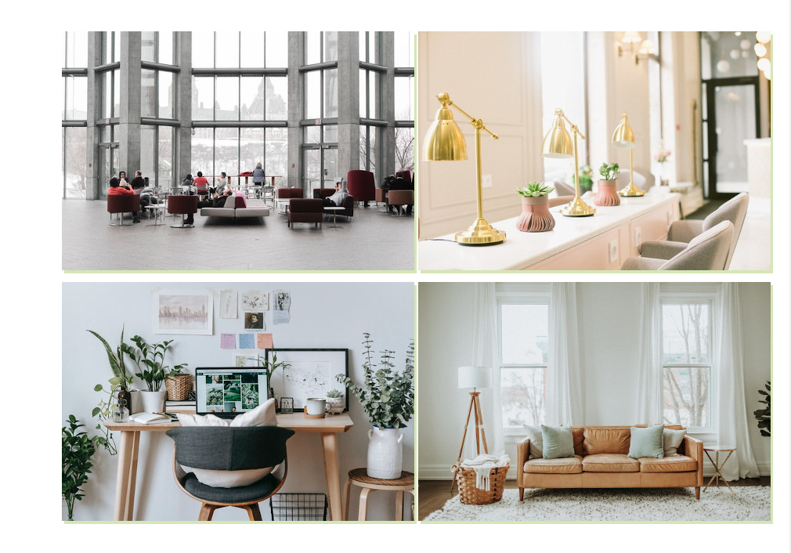
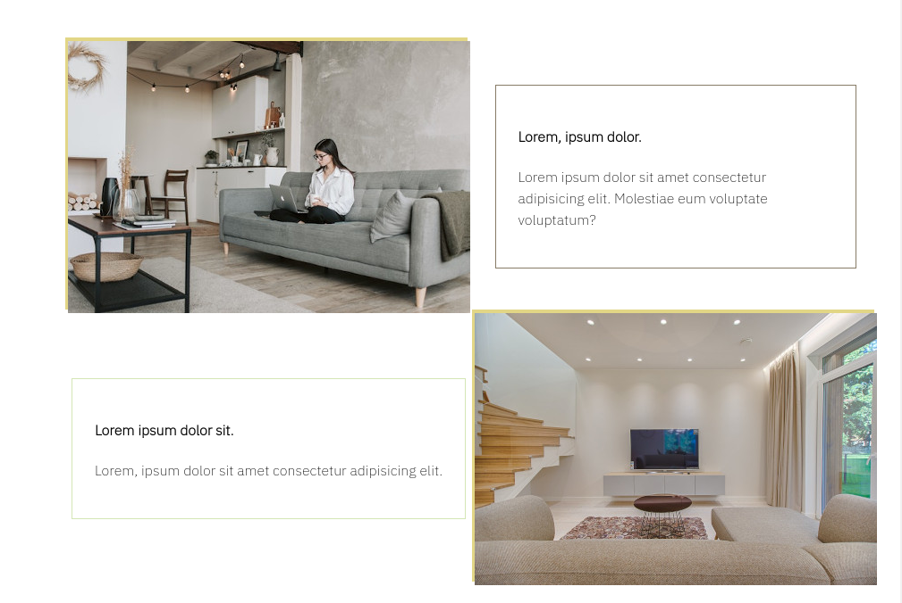
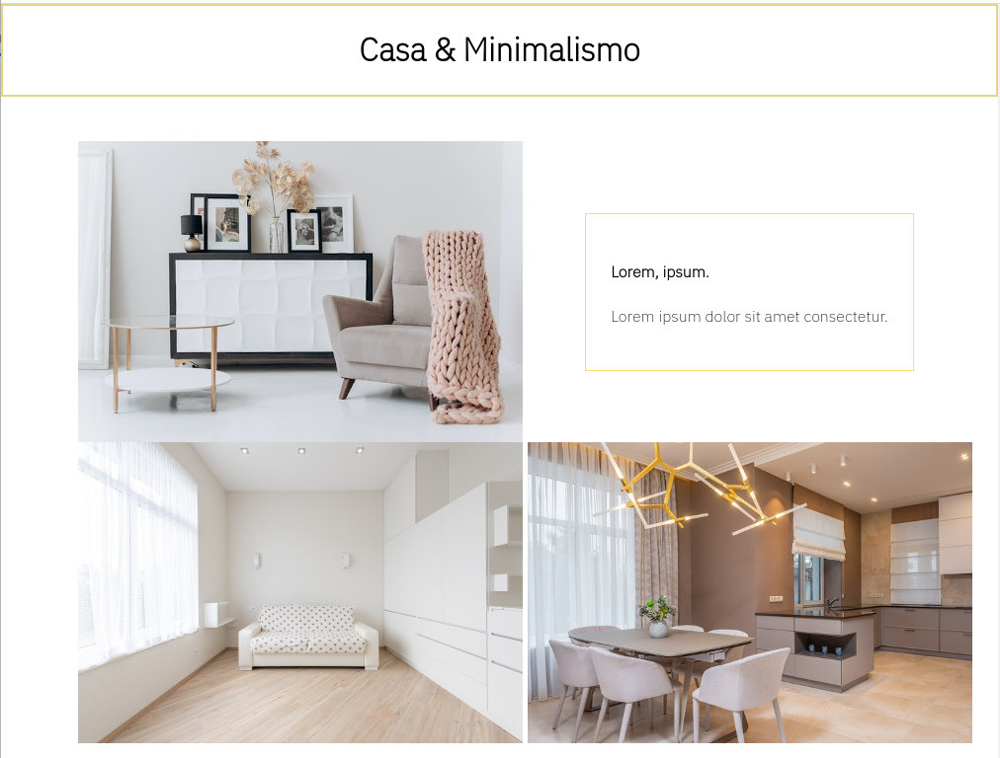
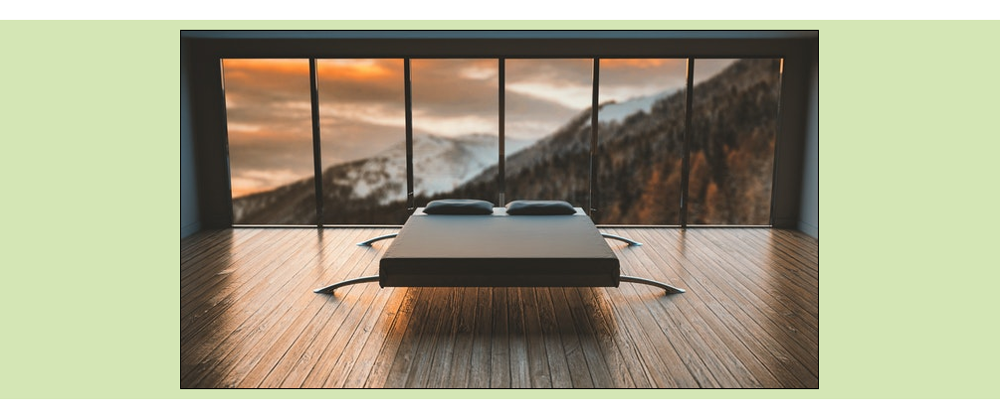
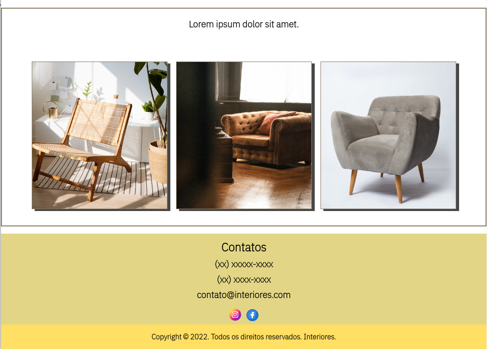

# Interiores

A Interiores é um escopo de um site para Design de Interiores.

## Execução

Clone o repositório e depois navegue pelo diretório desejado, após isso, execute o arquivo .html no browser ou IDE (ambiente de desenvolvimento) desejado.

## Tecnologias Utilizadas

- HTML5
- CSS3
- JavaScript

## Modelo:

### Seção inicial.

### Grid de imagens.

### Grid de imagens part. 2.

### Seção minimalista com grid de imagens.

### Slide show com JavaScript e imagens minimalistas.

### Seção de amostra de móveis e contatos.

## Direitos autorais

Ícone utilizado foi criado pelo Designer Freepik
